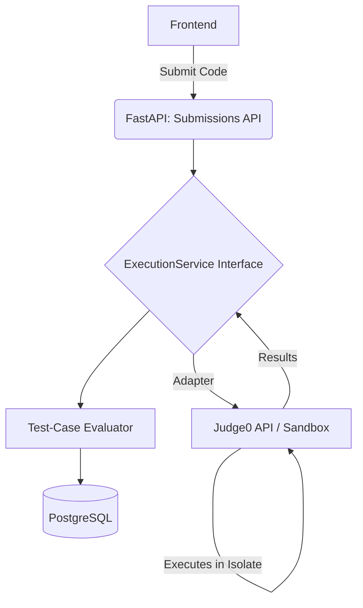

# Execution Architecture for DEV Placement OS (Phase 3)

## A. Executive Recommendation

**Architectural Judgment:** The code execution layer is the highest security risk in the DEV Placement OS architecture. Untrusted Python code execution must be strictly isolated from the application, the database, and the host kernel. 

For Phase 3 MVP, **rely on a self-hosted or managed Judge0 instance** acting as a remote sandbox, strictly abstracted behind an `ExecutionProvider` interface. The FastAPI application must *never* execute code locally. Do not over-engineer queues (Kafka/Redis) or Kubernetes clusters yet; the MVP should use simple, synchronous HTTP calls (or simple polling) to Judge0. 

In the future, transitioning to a **Firecracker MicroVM or gVisor** based self-owned execution infrastructure is recommended for defense-in-depth, as standard Docker containers are insufficient for a production-grade multi-tenant code execution environment.

---

## B. Threat Model for Untrusted Python Execution

Executing untrusted learner code presents severe security vectors:

1.  **Remote Code Execution (RCE) / Host Compromise:** Learner executes kernel exploits via Python `ctypes` or `os` to break out of the container and control the host.
2.  **Resource Exhaustion (Denial of Service):** 
    *   *CPU/Memory:* Infinite loops (`while True: pass`) or memory leaks crash the worker node.
    *   *Process:* Fork bombs (`os.fork()`) exhaust process IDs, hanging the host.
    *   *Storage:* Writing infinite data to the filesystem fills the host disk.
3.  **Data Exfiltration & Lateral Movement:** Python code imports `urllib` or `requests` to scan the internal network, steal database credentials from environment variables, or read `/etc/passwd`.
4.  **Output Flooding:** Code prints gigabytes of text to `stdout`, causing memory exhaustion in the FastAPI backend when it attempts to parse the JSON response.

---

## C. Architecture



**Execution Lifecycle:**
1.  **Submission:** FastAPI receives `code` and `problem_id`.
2.  **Queue/Worker (Phase 3 MVP):** FastAPI uses an asynchronous HTTP request (`httpx`) to Judge0's submission API. No Kafka/Celery is used yet.
3.  **Sandbox:** Judge0 places the code in an isolated environment, applies constraints, and executes it against inputs.
4.  **Execution & Result:** Judge0 returns raw outputs, exit codes, and memory/time metrics.
5.  **Normalization:** The Adapter maps Judge0 statuses to internal OS statuses.
6.  **Evaluation:** FastAPI compares `actual_output` against `expected_output` (tolerances applied if necessary) and securely handles hidden tests.

---

## D. Execution-Provider Interface

**Evidence-Backed Requirement:** The PRD strictly requires an abstraction layer to prevent lock-in to Judge0.

**1. Interface (`ExecutionProvider`)**
```python
class ExecutionProvider(ABC):
    @abstractmethod
    async def execute_batch(self, request: ExecutionRequest) -> List[ExecutionResult]:
        pass
```

**2. Request Contract (`ExecutionRequest`)**
*   `code`: string
*   `language`: string (e.g., "python3")
*   `test_cases`: list of `TestCase` (inputs, expected outputs)
*   `time_limit`: float (seconds)
*   `memory_limit`: int (kilobytes)

**3. Result Contract (`ExecutionResult`)**
*   `status`: normalized enum (e.g., `ACCEPTED`, `RUNTIME_ERROR`)
*   `stdout`: string (truncated)
*   `stderr`: string (truncated)
*   `compile_output`: string (empty for Python, usually)
*   `execution_time`: float
*   `memory_used`: int

**4. Status Normalization Mapping**
The provider must map external statuses to the PRD's exact enums:
*   `QUEUED`, `RUNNING`, `ACCEPTED`, `WRONG_ANSWER`, `COMPILATION_ERROR`, `RUNTIME_ERROR`, `TIME_LIMIT_EXCEEDED`, `MEMORY_LIMIT_EXCEEDED`, `SYSTEM_ERROR`.

**5. Timeout/Error Handling**
If the HTTP request to the provider times out, or the provider returns a 5xx error, the adapter must catch this and yield a `SYSTEM_ERROR` rather than crashing the FastAPI request.

---

## E. Judge0 Adapter Design

The `Judge0ExecutionService` will implement `ExecutionProvider`.
*   **Language ID:** Map "python3" to Judge0's Python 3.x ID (usually `71` or `92`).
*   **Batching:** Utilize Judge0's `/submissions/batch` endpoint.
*   **Polling vs Webhooks:** For Phase 3 MVP, use Judge0's `?wait=true` query parameter for synchronous execution if the time limit is small (< 5s). This avoids the need for exposing webhooks or managing Redis polling queues.

---

## F. Future Self-Owned Executor

A future self-owned executor will require:
1.  **Queueing System:** RabbitMQ or Redis + Celery to handle submission spikes asynchronously.
2.  **Worker Fleet:** Autoscaling worker nodes that consume the queue.
3.  **MicroVM Sandboxing:** Using **Firecracker** (AWS) or **gVisor** (Google) to execute the code.
4.  **Ephemeral File Systems:** A fresh, read-only rootfs layered with a strictly sized `tmpfs` for every single execution.

---

## G. Security Controls (Limits & Isolation)

*   **CPU / Wall-clock:** Limit to 2.0s CPU time, 5.0s Wall-clock time.
*   **Memory:** Hard limit of 256MB.
*   **Process (PIDs):** Limit to maximum 64 processes (prevents `os.fork` bombs).
*   **Filesystem:** Container root must be read-only (`--read-only`). A tiny `tmpfs` (max 10MB) can be mounted if temporary file writing is required for a specific problem.
*   **Network:** `none` (Loopback only). Python code must absolutely not be able to resolve DNS or reach the internet/intranet.
*   **Output-Size:** Judge0 must truncate `stdout` and `stderr` at 10KB. The FastAPI backend should enforce a secondary truncation check before parsing to prevent memory spikes.
*   **Preventing Test Leakage:** 
    *   Hidden tests are evaluated securely on the backend.
    *   If a hidden test fails, the UI must only display: *"Failed hidden test case #3"*. It must **never** return the `input`, `expected_output`, or the `stdout` of that specific run to the learner.
*   **Preventing Secret Access:** The execution sandbox must be injected with **zero** environment variables. No database URLs, no API keys, and no AWS credentials should exist in the sandbox environment.

---

## H. MVP vs Future

| Feature | Phase 3 MVP | Future Hardening |
| :--- | :--- | :--- |
| **Execution Engine** | Hosted/Local Judge0 (Docker/Isolate) | Self-hosted Firecracker MicroVMs / gVisor |
| **Concurrency** | Synchronous HTTP (`wait=true`) | Async Queue (Kafka/Redis + Webhooks) |
| **Filesystem** | Judge0 defaults | Explicitly built stripped-down rootfs |
| **Evaluation** | Basic exact/float matching | AST analysis, cyclomatic complexity checks |

---

## I. Technology Comparison

**Docker / Container Isolation:**
*   *Benefits:* Easy to use, fast startup, uses namespaces (PID, Mount, Network) and cgroups (Memory, CPU).
*   *Limitations:* Containers share the host kernel. A kernel vulnerability (e.g., Dirty COW) allows a student to break out of the container and take over the host. **Containers alone are NOT sufficient for a production untrusted-code sandbox.**

**Additional Isolation:**
*   **Seccomp:** Essential. Filters the system calls the Python code can make to the kernel.
*   **gVisor (Google):** Runs a user-space kernel (Sentry) that intercepts and safely handles syscalls. Excellent security upgrade over standard Docker, moderate performance overhead.
*   **Firecracker (AWS Lambda):** Creates lightweight MicroVMs using KVM. Hardware-level virtualization. The gold standard for untrusted multi-tenant code execution. 

**Judge0 vs Self-Owned:**
Judge0 uses `isolate` (a tool originally built for competitive programming using cgroups and namespaces). It is reasonably secure, but a highly determined attacker finding a kernel zero-day could compromise a Judge0 host. A self-owned Firecracker infrastructure offers superior security but requires specialized DevSecOps engineering.

---

## J. Open Decisions

1.  **Tolerance Policy:** For floating point problems, what is the default epsilon (e.g., `1e-6`)?
2.  **Infinite Loop Handling:** If `wait=true` is used in Judge0, will the HTTP connection drop before the Judge0 internal timeout triggers? The backend timeout must be strictly larger than the Judge0 execution timeout.
3.  **Local Development:** Does every developer need to run a local Judge0 docker-compose stack, or will there be a shared staging Judge0 instance for local development to save laptop resources?

---

## K. Exact Recommendations for Codex Implementation

When implementing Phase 3, the AI/Developer must:
1.  Create `app/services/execution_service.py` with `class ExecutionProvider(ABC):`.
2.  Create `app/schemas/execution.py` defining `ExecutionRequest`, `ExecutionResult`, and the `ExecutionStatus` Enum exactly as defined in the PRD.
3.  Implement `class Judge0ExecutionService(ExecutionProvider):` using `httpx` (async HTTP client).
4.  Use `wait=true` on the Judge0 API for simplicity, wrapped in a strict `asyncio.timeout()`.
5.  Do **not** add Redis, Celery, or Kafka to the `docker-compose.yaml` or `requirements.txt`.
6.  Do **not** write code to evaluate the code inside the sandbox. The sandbox only returns `stdout`. FastAPI compares `stdout` to `expected_output` in the backend.
